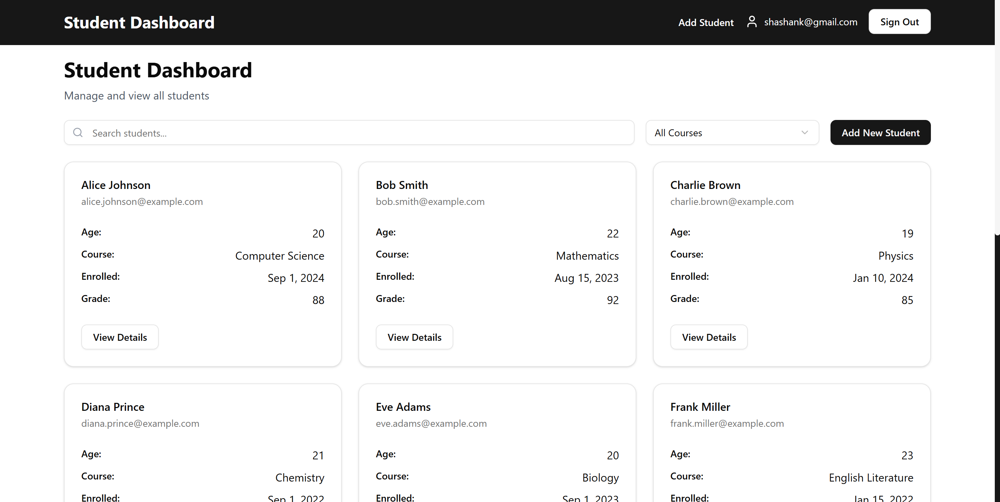
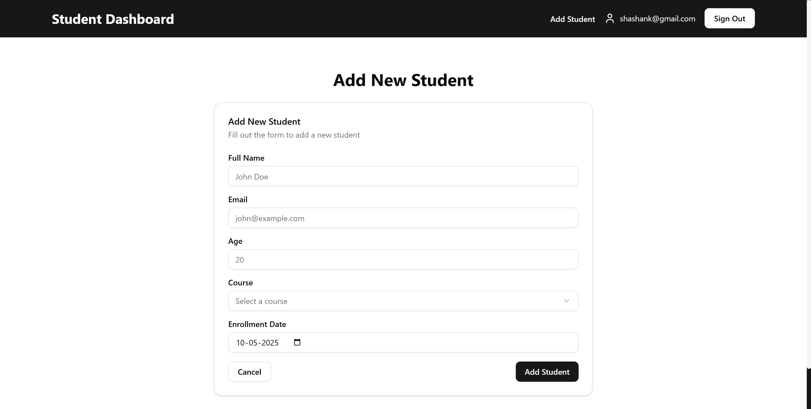

# Student Dashboard

A modern, full-stack student dashboard built with **Next.js**, **React**, **TypeScript**, **Firebase**, and **Tailwind CSS**. This project allows you to manage student records, including authentication, adding, viewing, and filtering students.

---

---

## Features

- **Authentication**: Register, login, and logout using Firebase Auth.
- **Student Management**: Add, view, and filter students by course or search by name/email.
- **Responsive UI**: Clean, modern interface using Tailwind CSS and custom UI components.
- **Persistent Data**: Student data is stored in Firebase Firestore.
- **Reusable Components**: Includes forms, cards, navbar, and more.
- **Toasts & Feedback**: User feedback via react-hot-toast.

---

## Usage

- **Dashboard**: View all students, filter by course, or search by name/email.
- **Add Student**: Add a new student (requires authentication).
- **Student Details**: Click a student to view detailed info.
- **Authentication**: Register or login to access protected features.